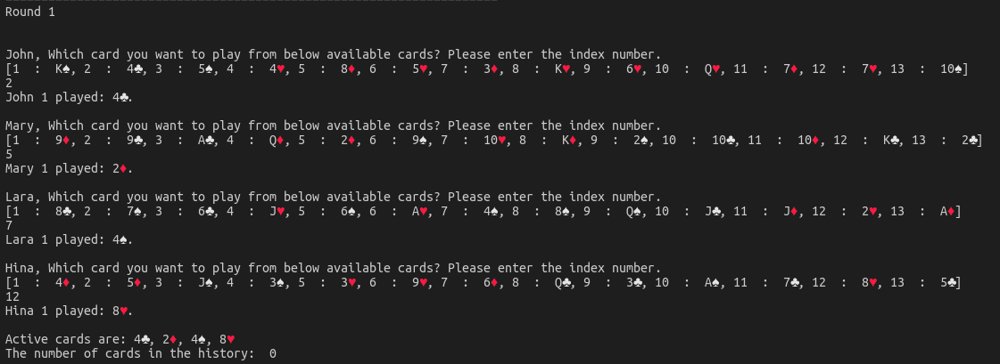

# A Card Game

This is the card game where any number of player can play the game. Project create the deck of 52 cards then distribute those between all the player. Then game will start where each player plays a card at every turn, until there are no cards left. Game will over when there is no more card left with player.

## Prerequisite to run the project

Python 3 should be install in you system.
To install python you can follow the link [Install Python](https://realpython.com/installing-python/#how-to-install-python-on-macos)
## How to run the project?

To run this project execute below commands

`git clone https://github.com/reenakoshta10/challenge-card-game-becode.git`

`cd challenge-card-game-becode`

`python main.py`

## What should you do project execution started?

- Enter the number of player wants to play game(This should be non-zero positive integer value)
- Enter name for each player

## What after providing player details?

Game will be played automatically between all player.  
After each round it should show message like below

## When will the game end?

Game will end when no player left with card.

## What is in project module?

Project has structure as below-
- asset folder - contains image used in README.md file
- utils folder - contains below files
  * card.py - it cantains information about card symbol and value
  * game.py - contains the logic of game 
  * player.py - contains details about how deck will be created, shuffled and card destributed and how player plays game.
- main.py - contain logic to start game

## Contact

Created by [Reena Koshta](https://github.com/reenakoshta10) - feel free to contact me!
## Have a nice day!
